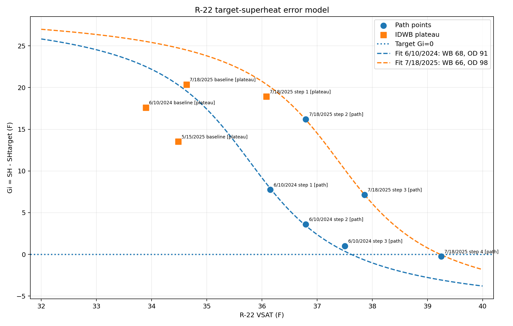
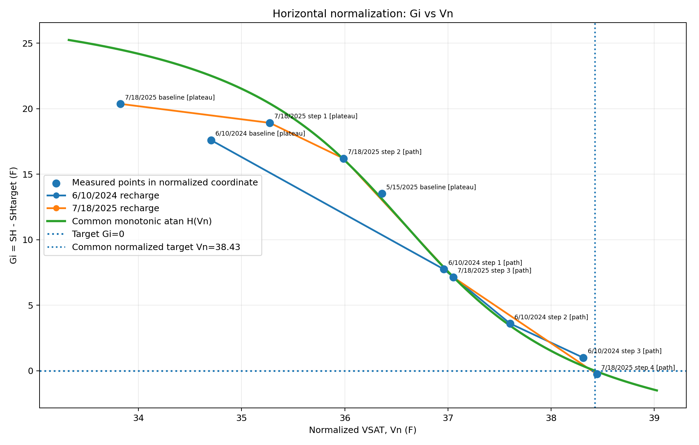

# House-Specific R-22 Charging Model

## Algorithm and Implementation

This document describes the empirical R-22 charging model implemented in `r22_charge_model.py`, the reasoning behind the model, how the model evolves as recharge data accumulate, and how the fitted model is converted back into practical charging targets: target superheat, target evaporator saturation temperature (VSAT), target suction pressure (LOW), and target suction-line temperature (SLT).

The model is intentionally **house/system specific**. It does not attempt to replace the standard fixed-orifice target-superheat method. Instead, it uses the standard target-superheat equation as the physical reference and learns how this particular system approaches that target as charge is added.

The worked examples throughout this document use `demo_data.json` (in the same folder as the script) — a representative two-recharge history in the same shape real field data takes, used here to keep every formula grounded in a concrete run of `r22_charge_model.py` rather than purely abstract numbers. It's the same history the deployed tool's own "Demo" site uses (`buildDemoSite()` in `index.html`), just with fixed calendar dates instead of dates relative to today.

---

## 1. Measurements and notation

For each stabilized observation, the following quantities are required:

- `LOW`: suction-side pressure, psig.
- `SLT`: suction-line temperature measured at the condenser, °F.
- `IDWB`: indoor wet-bulb temperature, °F.
- `ODDB`: outdoor dry-bulb temperature, °F.

From LOW pressure, obtain the R-22 evaporator saturation temperature:

$$
\boxed{V = VSAT = T_{sat,R22}(LOW)}
$$

In production this should use a complete R-22 pressure/temperature table with interpolation. The script currently contains only the small P/T anchor table used during development.

The normal model domain is currently restricted to:

$$
\boxed{32^\circ F \le VSAT \le 40^\circ F}
$$

Measurements below 32°F VSAT are retained in the history but classified as `outside`; they do not define the normal charging curve. This is deliberate because a sub-freezing evaporator may be in a transient/freezing regime.

---

## 2. Standard superheat equations

Actual superheat is defined by:

$$
\boxed{SH = SLT - VSAT}
$$

For this fixed-orifice system, target superheat is:

$$
\boxed{SH_t = \frac{3\,IDWB - 80 - ODDB}{2}}
$$

The constant 80 is part of the target-superheat formula; it is not an empirically fitted pivot.

Define adjusted suction-line temperature:

$$
\boxed{SLT_a = SLT - SH_t}
$$

Then:

$$
SLT_a - VSAT
= SLT - SH_t - VSAT
= SH - SH_t
$$

Define the superheat error:

$$
\boxed{G_i = SH - SH_t = SLT_a - VSAT}
$$

This is the central dependent variable in the model.

Interpretation:

- $G_i > 0$: measured superheat is above target; the system is still on the undercharged side of the target.
- $G_i = 0$: measured superheat equals target superheat.
- $G_i < 0$: measured superheat is below target; this is beyond the target according to the standard superheat criterion.

The important advantage is that **the correct charge is always represented by the same mathematical condition**:

$$
\boxed{G_i = 0}
$$

regardless of IDWB and ODDB.

---

## 3. Why raw `Gi vs VSAT` is not sufficient

Different recharge sessions approach $G_i=0$ at different VSAT values because the operating conditions differ.

For the current data:

- 6/10/2024 finished near VSAT = 37.505°F with $G_i = +0.995°F$.
- 7/18/2025 finished near VSAT = 39.250°F with $G_i = -0.250°F$.

Both are effectively target endpoints, but their target VSAT values differ by about 1.75°F.

Therefore the model does not assume one universal target VSAT. Instead, environmental conditions shift the charging curve **horizontally** along the VSAT axis.

---

## 4. Horizontally normalized VSAT

Define normalized VSAT:

$$
\boxed{
V_n = VSAT
      - a(IDWB-I_0)
      - b(ODDB-O_0)
}
$$

where:

- $I_0$: indoor wet-bulb pivot derived from accepted recharge endpoints.
- $O_0$: outdoor dry-bulb pivot derived from accepted recharge endpoints.
- $a$: fitted horizontal shift in VSAT per °F IDWB.
- $b$: fitted horizontal shift in VSAT per °F ODDB.

The pivots are not physical constants. They are centering values that improve numerical conditioning and make the fitted intercept easy to interpret.

For equal endpoint weights, the model computes:

$$
\boxed{I_0 = \frac{1}{N}\sum_{j=1}^N I_j}
$$

$$
\boxed{O_0 = \frac{1}{N}\sum_{j=1}^N O_j}
$$

where $j$ indexes accepted completed recharge endpoints.

If endpoint-quality weights are added later, these can be replaced by weighted means.

---

## 5. Target model

The normalized target is defined as one constant:

$$
\boxed{V_{n,t} = R}
$$

Therefore:

$$
R = VSAT_t-a(IDWB-I_0)-b(ODDB-O_0)
$$

and the practical target-VSAT equation is:

$$
\boxed{
VSAT_t = R+a(IDWB-I_0)+b(ODDB-O_0)
}
$$

This is the main target function.

Once $R,a,b,I_0,O_0$ are known, current IDWB and ODDB are enough to calculate the final target VSAT.

---

## 6. Path model: `Gi = H(Vn)`

After horizontal normalization, the accepted recharge-path points are modeled by one common monotonic function:

$$
\boxed{G_i = H(V_n)}
$$

The model uses a zero-preserving arctangent function:

$$
\boxed{
H(x)=B\left[
\arctan\left(\frac{R-C}{W}\right)
-
\arctan\left(\frac{x-C}{W}\right)
\right]
}
$$

with constraints:

$$
B>0,\qquad W>0
$$

This form was chosen for three reasons.

### 6.1 It is monotonic

$$
\frac{dH}{dx}
=
-\frac{B/W}{1+((x-C)/W)^2}<0
$$

Thus increasing normalized VSAT always decreases predicted superheat error.

### 6.2 It preserves the exact target

Substitute $x=R$:

$$
\boxed{H(R)=0}
$$

The fitted path function therefore cannot move the target away from $G_i=0$.

### 6.3 It has finite behavior

Unlike the exploratory exponential fit, the atan model does not diverge rapidly as VSAT moves away from the measured region.

The path parameters have the following roles:

- $B$: vertical scale of superheat error.
- $C$: approximate center of the steep transition.
- $W$: width/sharpness of the transition.
- $R$: normalized target VSAT; this comes from the target model and is shared with the path model.

---

## 7. Point classification

Each historical observation is classified before or during fitting.

### 7.1 Outside normal VSAT range

If:

$$
VSAT<32^\circ F
\quad\text{or}\quad
VSAT>40^\circ F
$$

it is classified as:

`outside`

and is not used for the normal charging model.

A reading taken while the system is badly undercharged (a near-empty first baseline, for example) commonly falls well below 32°F VSAT — a real low-charge point at LOW = 43 psig, for instance, corresponds to approximately VSAT = 19.9°F. Such points are retained in the history but, being that far outside the fitted region, add little beyond confirming the system started out badly low; the current demo dataset's own low-charge baseline was trimmed for exactly that reason (see §14).

### 7.2 IDWB plateau

The current initial plateau screen is:

$$
\boxed{SLT \ge IDWB - 2^\circ F}
$$

Such points are classified as:

`plateau`

They are retained and displayed, but are not ordinary path-fit observations because the measured SLT is considered limited by the IDWB plateau rather than exposing the underlying descending charging curve.

Examples from 7/18/2025:

- VSAT 34.63°F, SLT 65°F, IDWB 66°F → plateau.
- VSAT 36.08°F, SLT 65°F, IDWB 66°F → plateau.

### 7.3 Path points

Points inside 32–40°F VSAT and sufficiently below the IDWB plateau are initial path candidates.

Examples from 7/18/2025:

- VSAT 36.79°F, SLT 63°F, $G_i\approx16.21°F$.
- VSAT 37.86°F, SLT 55°F, $G_i\approx7.14°F$.
- VSAT 39.25°F, SLT 49°F, $G_i\approx-0.25°F$.

### 7.4 Outliers

Path residuals are evaluated against the fitted model.

For residuals:

$$
e_i=G_i-H(V_{n,i})
$$

The model estimates a robust residual scale using the median absolute deviation:

$$
\boxed{
\sigma_r=1.4826\,MAD(e_i)
}
$$

The rejection threshold is:

$$
\boxed{
T=\max(3^\circ F,3\sigma_r)
}
$$

If:

$$
|e_i|>T
$$

the point is classified as:

`outlier`

A reading measured with different gauges, before the system had stabilized, or otherwise inconsistent with the rest of a recharge sequence would be automatically rejected this way — it remains visible in the plots and history but does not steer the fit. The current demo dataset happens to contain no such point; every observation lies within threshold of the fitted curve (see the classification table in §14).

---

## 8. Recharge endpoints

Completed recharge sessions provide the strongest information about the final target surface.

For each recharge session, the model selects the **last recorded point** as the candidate endpoint.

A candidate endpoint is accepted if:

1. Its VSAT is in the model domain:

$$
32^\circ F\le VSAT\le40^\circ F
$$

2. Its measured superheat error is close enough to zero:

$$
\boxed{|G_i|\le3^\circ F}
$$

(`ENDPOINT_G_TOL_F` in `r22_charge_model.py` matches the deployed tool's `index.html` value — both use 3°F, the same "green zone" tolerance the rest of the UI already uses for gauge coloring and endpoint acceptance. The examples below still qualify under this tolerance.)

The current accepted endpoints are:

| Date | IDWB | ODDB | VSAT | LOW | SLT | Gi |
|---|---:|---:|---:|---:|---:|---:|
| 6/10/2024 | 68°F | 91°F | 37.505°F | 65.0 psig | 55°F | +0.995°F |
| 7/18/2025 | 66°F | 98°F | 39.250°F | 67.5 psig | 49°F | -0.250°F |

These two target points are the primary constraints on the current target model.

---

# 9. How the model evolves as endpoints accumulate

This is the most important part of the incremental algorithm.

## 9.1 Zero accepted endpoints

There is no established target surface yet.

The script currently raises an error because it requires at least one accepted completed recharge endpoint.

The bootstrap charging policy discussed during development is **not implemented in `r22_charge_model.py`** (it just raises when zero endpoints exist). The intended bootstrap behavior is:

- If VSAT < 32°F, add charge conservatively until VSAT is approximately 32–33°F.
- Above 32°F, collect stabilized LOW/SLT points.
- While SLT is at the IDWB plateau and superheat error is large, make conservative approximately 2-psi LOW increments.
- After SLT clearly leaves the plateau, reduce to approximately 1-psi increments.
- Within about 5°F of target SH, use very short bursts rather than trying to force the analog gauge to the next whole psi.
- At approximately 3°F or less positive superheat error, stop charging and stabilize.
- Do not bootstrap-charge past approximately VSAT = 40°F solely on this logic.

This gap is filled in the deployed tool: `index.html`'s `computeBootstrapGuidance()` implements exactly this policy (including the 3°F stop threshold, matching the ±3°F "accepted" tolerance elsewhere in the app) for the zero-endpoint case, so the live tool never actually raises here the way the reference script does.

---

## 9.2 One accepted recharge endpoint

With one endpoint $(I_1,O_1,V_1)$, there is not enough information to determine environmental shifts.

The script sets:

$$
\boxed{I_0=I_1}
$$

$$
\boxed{O_0=O_1}
$$

$$
\boxed{R=V_1}
$$

$$
\boxed{a=0,\qquad b=0}
$$

State:

`one-endpoint`

The target equation therefore temporarily reduces to:

$$
\boxed{VSAT_t=R}
$$

This is a valid first approximation near the conditions of the first recharge, but it contains no learned environmental correction.

The recharge's intermediate non-plateau points can still be used to fit a preliminary path shape $H(V_n)$, provided at least three usable path points exist.

---

## 9.3 Two accepted recharge endpoints

With two target endpoints there are two endpoint equations:

$$
V_1=R+a(I_1-I_0)+b(O_1-O_0)
$$

$$
V_2=R+a(I_2-I_0)+b(O_2-O_0)
$$

but three target coefficients $R,a,b$.

Therefore both environmental coefficients cannot be uniquely determined from endpoints alone.

Model state:

`provisional-path-assisted`

### 9.3.1 Data-derived pivots

For the two accepted current endpoints:

$$
I_0=\frac{68+66}{2}=67.0^\circ F
$$

$$
O_0=\frac{91+98}{2}=94.5^\circ F
$$

### 9.3.2 Joint provisional fit

The script jointly fits:

$$
R,a,b,B,C,W
$$

using two types of residuals.

Endpoint residuals:

$$
\boxed{
e^{(target)}_j
=
R+a(I_j-I_0)+b(O_j-O_0)-V_j
}
$$

These receive a stronger numerical weight in the current implementation:

$$
4\,e^{(target)}_j
$$

because completed target endpoints are more important than intermediate path observations for locating the final target.

Path residuals:

$$
\boxed{
e^{(path)}_i
=
H(V_{n,i})-G_i
}
$$

Weak regularization is added to avoid extreme environmental coefficients in the underdetermined case:

$$
0.15a,\qquad0.15b
$$

The optimizer uses SciPy `least_squares()` with Huber loss:

`loss="huber", f_scale=1.5`

### 9.3.3 Recharge points seed the provisional fit

When the model is underdetermined, the script initially uses non-plateau points from actual **recharge sequences** as the path-fit seed.

Non-recharge checkup points are validation candidates. They are admitted only if they agree with the recharge-derived provisional curve within the robust residual threshold.

This prevents one questionable checkup measurement from selecting the environmental coefficients in a two-endpoint fit — any checkup point that disagreed with the recharge-derived curve would be rejected the same way, rather than being allowed to steer the provisional model.

### 9.3.4 Current two-endpoint provisional result

For the current dataset, the script obtains:

$$
\boxed{I_0=67.0000^\circ F}
$$

$$
\boxed{O_0=94.5000^\circ F}
$$

$$
\boxed{R=38.4251^\circ F}
$$

$$
\boxed{a=-0.060951}
$$

$$
\boxed{b=0.213324}
$$

These $a,b$ values are **provisional**, because only two independent accepted target endpoints exist.

The path fit is:

$$
B=11.876773
$$

$$
C=36.575108^\circ F
$$

$$
W=1.337111^\circ F
$$

with six accepted path points and current path RMSE:

$$
\boxed{RMSE\approx0.288^\circ F}
$$

---

## 9.4 Three accepted endpoints

Three endpoints are the first point at which the three target coefficients $R,a,b$ *may* be directly identifiable.

Define the centered design matrix:

$$
X=
\begin{bmatrix}
1 & I_1-I_0 & O_1-O_0\\
1 & I_2-I_0 & O_2-O_0\\
1 & I_3-I_0 & O_3-O_0
\end{bmatrix}
$$

and:

$$
y=
\begin{bmatrix}
V_1\\V_2\\V_3
\end{bmatrix}
$$

If:

$$
\boxed{rank(X)=3}
$$

then the target coefficients are independently identifiable.

The model switches to state:

`endpoint-regression`

and computes:

$$
\boxed{
\begin{bmatrix}
R\\a\\b
\end{bmatrix}
=
\operatorname{lstsq}(X,y)
}
$$

In code this is `numpy.linalg.lstsq()`, not an explicit matrix inverse.

At this stage, intermediate path points **no longer determine** $R,a,b$. They are used only to fit $B,C,W$ in $H(V_n)$.

### Why three endpoints can still be insufficient

Three points are not automatically enough. The environmental conditions must vary independently.

For example, if every increase in ODDB is accompanied by exactly proportional change in IDWB, the columns of $X$ may be linearly dependent and:

$$
rank(X)<3
$$

In that case the model remains in provisional path-assisted mode until the endpoint set becomes full rank.

---

## 9.5 Four, five, and more accepted endpoints

Once the endpoint design has full rank, every additional accepted recharge endpoint adds another row:

$$
[1,\ I_j-I_0,\ O_j-O_0]
$$

with measured target VSAT $V_j$.

The least-squares problem becomes overdetermined, which is desirable.

With additional target endpoints:

- $I_0$ and $O_0$ are recomputed from the accepted endpoint set.
- $R,a,b$ are refitted from all accepted endpoints.
- Intermediate accepted path observations are renormalized using the new $a,b,I_0,O_0$.
- $B,C,W$ are then refitted to the updated $G_i=H(V_n)$ path.

Thus every good recharge improves both the final-target surface and the approach-to-target curve.

---

# 10. How path data accumulate

The target regression uses recharge endpoints, while the path model uses individual stabilized observations.

After target normalization is available, each usable observation supplies:

$$
V_{n,i}
=
V_i-a(I_i-I_0)-b(O_i-O_0)
$$

and:

$$
G_i=SLT_i-V_i-SH_{t,i}
$$

The path optimizer minimizes robust residuals:

$$
\boxed{
e_i=H(V_{n,i})-G_i
}
$$

The accepted path points are accumulated over all sessions.

The current model therefore learns two different things from the historical data:

1. **Where the target occurs** under different IDWB/ODDB conditions: endpoint model $R,a,b$.
2. **How the system approaches that target**: path model $B,C,W$.

This separation is intentional.

---

# 11. Converting a fitted model into practical recharge targets

Once $R,a,b,I_0,O_0$ are available, the user needs to provide only current IDWB and ODDB.

Let:

$$
I=IDWB
$$

$$
O=ODDB
$$

## Step 1: target superheat

$$
\boxed{
SH_t=\frac{3I-80-O}{2}
}
$$

## Step 2: target VSAT

$$
\boxed{
VSAT_t=R+a(I-I_0)+b(O-O_0)
}
$$

## Step 3: target LOW pressure

Convert the target R-22 saturation temperature back to pressure:

$$
\boxed{
LOW_t=P_{R22}(VSAT_t)
}
$$

## Step 4: target SLT

Because at target:

$$
SH_t=SLT_t-VSAT_t
$$

then:

$$
\boxed{
SLT_t=VSAT_t+SH_t
}
$$

These four values are the principal final outputs shown to the person charging the system:

- target SH,
- target VSAT,
- target LOW,
- target SLT.

---

# 12. Example: 7/18/2025 conditions

Input:

$$
IDWB=66^\circ F
$$

$$
ODDB=98^\circ F
$$

Current target model:

$$
I_0=67.0000
$$

$$
O_0=94.5000
$$

$$
R=38.4251
$$

$$
a=-0.060951
$$

$$
b=0.213324
$$

### Target SH

$$
SH_t
=\frac{3(66)-80-98}{2}
=10.0^\circ F
$$

### Target VSAT

$$
VSAT_t
=38.4251
-0.060951(66-67)
+0.213324(98-94.5)
$$

The script reports:

$$
\boxed{VSAT_t=39.233^\circ F}
$$

### Target LOW

Using the current R-22 P/T interpolation:

$$
\boxed{LOW_t=67.475\text{ psig}}
$$

### Target SLT

$$
SLT_t=39.233+10.0
$$

$$
\boxed{SLT_t=49.233^\circ F}
$$

Actual final 7/18/2025 observation:

- LOW ≈ 67.5 psig,
- VSAT ≈ 39.25°F,
- SLT = 49°F,
- $G_i\approx-0.25°F$.

The predicted target is therefore very close to the observed endpoint, as expected because that endpoint is one of the two primary target constraints.

---

# 13. Example: 6/10/2024 endpoint

Observed final recharge point:

- IDWB = 68°F,
- ODDB = 91°F,
- LOW = 65 psig,
- VSAT ≈ 37.505°F,
- SLT = 55°F.

Target superheat:

$$
SH_t
=\frac{3(68)-80-91}{2}
=16.5^\circ F
$$

Measured actual superheat:

$$
SH=55-37.505\approx17.495^\circ F
$$

Therefore:

$$
G_i\approx17.495-16.5
$$

$$
\boxed{G_i\approx+0.995^\circ F}
$$

Since this is within the current ±3°F endpoint acceptance tolerance, it is accepted as a target endpoint.

---

# 14. Current point classifications from demo data

The script currently classifies the historical dataset approximately as follows:

| Date | Stage | VSAT | SLT | IDWB | ODDB | Gi | Status |
|---|---|---:|---:|---:|---:|---:|---|
| 6/10/2024 | baseline | 33.89 | 68 | 68 | 91 | +17.61 | plateau |
| 6/10/2024 | step 1 | 36.15 | 60.4 | 68 | 91 | +7.75 | path |
| 6/10/2024 | step 2 | 36.79 | 56.9 | 68 | 91 | +3.61 | path |
| 6/10/2024 | step 3 | 37.50 | 55 | 68 | 91 | +1.00 | path / accepted endpoint |
| 5/15/2025 | baseline | 34.49 | 67 | 68 | 86 | +13.51 | plateau |
| 7/18/2025 | baseline | 34.63 | 65 | 66 | 98 | +20.37 | plateau |
| 7/18/2025 | step 1 | 36.08 | 65 | 66 | 98 | +18.92 | plateau |
| 7/18/2025 | step 2 | 36.79 | 63 | 66 | 98 | +16.21 | path |
| 7/18/2025 | step 3 | 37.86 | 55 | 66 | 98 | +7.14 | path |
| 7/18/2025 | step 4 | 39.25 | 49 | 66 | 98 | -0.25 | path / accepted endpoint |

There's no separate precursor checkup for either recharge here — a checkup whose last reading is immediately recharged (the deployed tool's "Switch to Recharge" flow) adds nothing a recharge's own baseline doesn't already capture, and pooling both sessions' points independently would otherwise double-count that one physical reading (see §21 for the general case, since the deployed tool's `switchedFromCheckupId` / `checkupTrulyAbsorbed` dedup only fires when a standalone checkup actually precedes the recharge in the data). The 6/10/2024 recharge's original near-empty first reading (LOW=43 psig, VSAT≈19.9°F, `outside`) was trimmed for the same reason as any `outside` point — see §7.1 — leaving its IDWB-plateau reading as the new baseline.

---

# 15. Plots

## 15.1 `Gi` versus raw VSAT

This plot shows the raw superheat error before horizontal environmental normalization.



Important features:

- The horizontal line $G_i=0$ is the exact target-superheat condition.
- The two recharge sequences approach zero at different raw VSAT values.
- This demonstrates why a single fixed target VSAT is insufficient.

## 15.2 Horizontal normalization: `Gi = H(Vn)`

This is the preferred diagnostic plot.



It shows:

- all points in normalized VSAT coordinates,
- 6/10/2024 recharge sequence connected,
- 7/18/2025 recharge sequence connected,
- the common monotonic $H(V_n)$ curve,
- horizontal target line $G_i=0$,
- vertical normalized target $V_n=R$,
- plateau and outlier points retained for visual inspection.

The purpose of the normalization is to make recharge sequences performed under different IDWB/ODDB conditions collapse onto a common path.

---

# 16. Practical use during an established-model recharge

Once the target model is established, the user enters current IDWB and ODDB.

The software computes immediately:

$$
SH_t
$$

$$
VSAT_t
$$

$$
LOW_t
$$

$$
SLT_t
$$

During charging, each stabilized observation provides current:

$$
V=VSAT(LOW)
$$

$$
G_i=SLT-V-SH_t
$$

and normalized position:

$$
V_n=V-a(IDWB-I_0)-b(ODDB-O_0)
$$

The fitted path model supplies:

$$
G_{pred}=H(V_n)
$$

As the system approaches the target:

$$
V_n\rightarrow R
$$

and:

$$
G_i\rightarrow0
$$

The final target LOW is a destination, not necessarily the recommended next analog-gauge reading. Near the endpoint, burst size should be reduced because SLT movement may be visible before a one-psi change can be resolved on an analog LOW gauge.

---

# 17. Suggested future charging-control layer

The current script is primarily a **model-fitting and target-calculation** implementation. A complete interactive charging controller can sit on top of it.

A conservative controller can use these stages:

### Freeze recovery

If:

$$
VSAT<32^\circ F
$$

recommend only enough incremental charging to move VSAT into approximately 32–33°F before normal modeling logic is used.

### Plateau/data-acquisition phase

If SLT remains near IDWB and $G_i$ is large, collect additional stabilized points with relatively coarse but conservative LOW increments.

### Path phase

Once SLT clearly leaves the IDWB plateau, use smaller increments and compare measured $G_i$ with $H(V_n)$.

### Final approach

As $G_i$ approaches zero, stop targeting whole-psi movement. Use short bursts, allow SLT to stabilize, and stop when the measured state is sufficiently close to the computed target.

This control layer should be treated separately from the statistical model so that safety/conservatism rules can be modified without changing the fitted target surface.

---

# 18. Numerical methods used

The script uses:

- SciPy `PchipInterpolator` for the current development R-22 pressure/temperature conversion.
- SciPy `least_squares()` for nonlinear provisional target/path fits.
- Huber robust loss for path fitting.
- Median absolute deviation for robust outlier screening.
- NumPy `linalg.lstsq()` for direct endpoint regression once the endpoint design matrix reaches full rank.

The provisional two-endpoint fit includes weak regularization on $a$ and $b$ solely because the problem is mathematically underdetermined with two endpoints.

Once full-rank endpoint regression is possible, this provisional dependence on path data is removed.

---

# 19. Current model state

For the present dataset:

```text
state              = provisional-path-assisted
accepted endpoints = 2
endpoint rank      = 2
I0                 = 67.0000 F
O0                 = 94.5000 F
R                  = 38.4251 F
a_IDWB             = -0.060951 F_VSAT/F_IDWB
b_ODDB             = 0.213324 F_VSAT/F_ODDB

B                  = 11.876773
C                  = 36.575108 F
W                  = 1.337111 F
path points        = 6
path RMSE          = 0.2880 F
```

For IDWB = 66°F and ODDB = 98°F:

```text
SH target   = 10.000 F
VSAT target = 39.233 F
LOW target  = 67.475 psig
SLT target  = 49.233 F
```

These environmental coefficients remain provisional until at least one additional independent accepted recharge endpoint is available.

---

# 20. Implementation command line

Typical use (run from the repo root; the script, its demo data, and its plot outputs are all in `model/`):

```bash
python model/r22_charge_model.py model/demo_data.json \
    --plot model/r22_charge_model_fit.png \
    --normalized-plot model/r22_Gi_vs_Vn_horizontal_normalization.png \
    --idwb 66 \
    --oddb 98
```

The program prints:

- target-model state,
- number and rank of accepted recharge endpoints,
- fitted $I_0,O_0,R,a,b$,
- accepted/rejected endpoints,
- fitted path parameters $B,C,W$,
- point classifications,
- target SH,
- target VSAT,
- target LOW,
- target SLT.

It also produces both the raw `Gi vs VSAT` and horizontally normalized `Gi vs Vn` diagnostic plots.

---

# 21. Important current limitations

1. **Two target endpoints are not enough to independently establish both environmental slopes.** The current $a,b$ values are provisional and path-assisted.

2. **The R-22 P/T table in the script is only a small development anchor set.** A full R-22 table should replace it before production use.

3. **The plateau threshold is currently a fixed 2°F rule.** With more data, plateau classification may be refined using the fitted curve rather than only the direct SLT–IDWB difference.

4. **The ±3°F endpoint acceptance tolerance is a configurable engineering choice**, not a derived physical constant — chosen to match the deployed tool's own UI "green zone" convention. Both `r22_charge_model.py` and `index.html` now use the same value.

5. **Analog gauge resolution and stabilization quality remain important.** The statistical model should not interpret small pressure deltas as precise measurements.

6. **The current script is not yet the complete live first-recharge controller.** It assumes at least one accepted completed recharge endpoint for the target model.

7. **A checkup absorbed into a same-day recharge is currently double-counted.** When a checkup's last reading becomes a recharge's baseline (the deployed tool's "Switch to Recharge" flow), `r22_charge_model.py` pools both sessions' points independently, so that one physical reading appears twice in the point classification (see §14). The deployed tool checks whether the reading was actually reused, unedited, before dropping the duplicate (`switchedFromCheckupId` / `checkupTrulyAbsorbed` in `index.html`); the reference script has no equivalent yet. In practice the duplicated point is classified `outside` or `plateau` in both places it's evaluated so far, so it hasn't affected a fit — but it would double-weight a duplicated `path` point if one ever occurred.

---

## Summary

The algorithm converts the standard target-superheat method into a system-specific normalized model without changing the definition of the target.

The key identities are:

$$
\boxed{G_i=SH-SH_t}
$$

$$
\boxed{V_n=VSAT-a(IDWB-I_0)-b(ODDB-O_0)}
$$

$$
\boxed{G_i=H(V_n)}
$$

$$
\boxed{H(R)=0}
$$

and therefore:

$$
\boxed{VSAT_t=R+a(IDWB-I_0)+b(ODDB-O_0)}
$$

followed by:

$$
\boxed{LOW_t=P_{R22}(VSAT_t)}
$$

$$
\boxed{SLT_t=VSAT_t+SH_t}
$$

As additional independent recharge endpoints are accumulated, the target coefficients transition from a one-point approximation, through a provisional two-point/path-assisted model, to a direct overdetermined endpoint regression. The intermediate recharge points then serve primarily to refine the common monotonic approach-to-target function $H(V_n)$.
